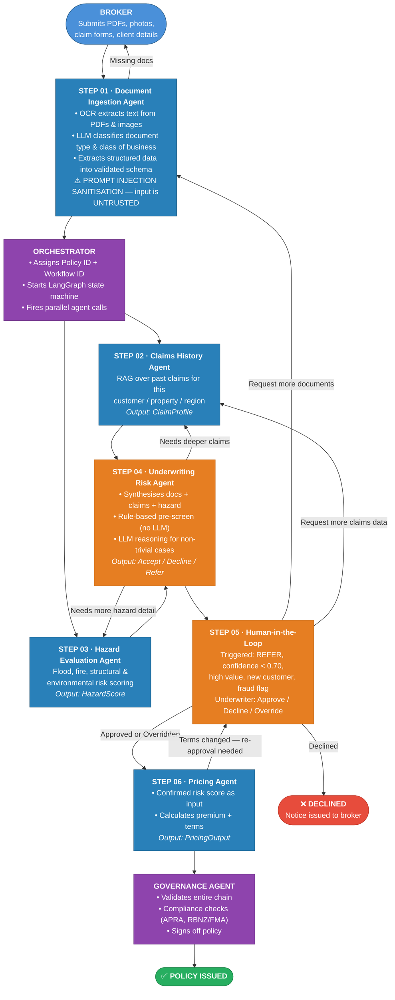

# End-to-End Underwriting Flow — AI Underwriting System

## The Real Business Flow

Insurance underwriting starts with a **broker** — not a user typing into a chat box.
A broker submits documents on behalf of their client. Those documents are messy, unstructured,
and come from an untrusted external party. The system must handle that reality.

Agents do not always move forward. Real underwriting involves **loopbacks** — an underwriter
requests more documents, a risk agent needs deeper claims data, pricing needs re-approval after
a coverage change. The orchestrator manages all of these paths.

---

## Flow Diagram (with loopbacks)



> **Render this diagram:** VS Code → install the [Markdown Preview Mermaid Support](https://marketplace.visualstudio.com/items?itemName=bierner.markdown-mermaid) extension → open Preview (Ctrl+Shift+V). Also renders automatically on GitHub.

---

## Loopback Summary

| From | Back to | Trigger |
|---|---|---|
| `document_ingestion_agent` | Broker (external) | Missing or incomplete documents |
| `underwriting_risk_agent` | `claims_history_agent` | Needs deeper or more specific claims data |
| `underwriting_risk_agent` | `hazard_evaluation_agent` | Needs specific hazard detail not in initial pass |
| `human_in_the_loop` | `document_ingestion_agent` | Underwriter requests additional broker documents |
| `human_in_the_loop` | `claims_history_agent` | Underwriter wants to verify a specific prior claim |
| `pricing_agent` | `human_in_the_loop` | Coverage or terms changed — underwriter must re-approve |

**Key principle:** The orchestrator owns all loopback logic. No agent calls another agent directly.
They return output to the orchestrator, which decides whether to proceed or loop back.
This keeps every loopback logged, intentional, and recoverable.

---

## Cross-Cutting Platform (active throughout)

```
┌──────────────────────────────────────────────────────────────────┐
│  src/underwriting/platform/security          Active at doc ingestion + every  │
│                                 agent boundary. Sanitises input, │
│                                 runs canary token checks.        │
├──────────────────────────────────────────────────────────────────┤
│  src/underwriting/platform/cost_tracking     Active at every LLM call.        │
│                                 Tags policy ID, agent, cost.     │
├──────────────────────────────────────────────────────────────────┤
│  src/underwriting/platform/observability     Active at every state transition.│
│                                 Logs decisions, latency, errors. │
├──────────────────────────────────────────────────────────────────┤
│  src/underwriting/platform/compliance_agent  Active at steps 04, 06, issuance.│
│                                 Checks APRA (AU), RBNZ/FMA (NZ).│
└──────────────────────────────────────────────────────────────────┘
```

---

## Why the Orchestrator Owns Loopbacks

A common mistake in multi-agent systems is letting agents call each other directly. This creates:
- **Circular dependency risk** — Agent A calls B, B calls A, loop never ends
- **Invisible state** — no central record of where the workflow actually is
- **Untraceable audit trail** — impossible to reconstruct the full decision path

In this system, every agent is a **pure function**: receives inputs, returns outputs, done.
The orchestrator is the only entity that knows the full workflow state and decides what
happens next — including whether to loop back. Every loopback is logged, intentional,
and recoverable from any point.
